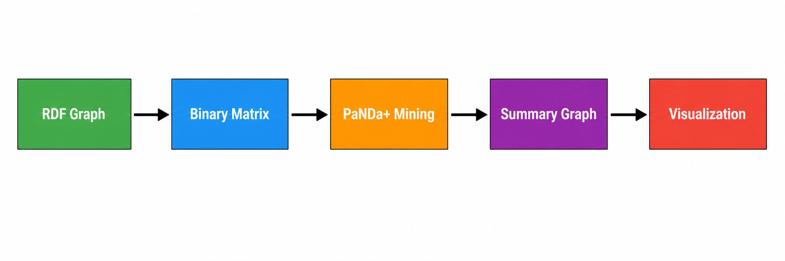
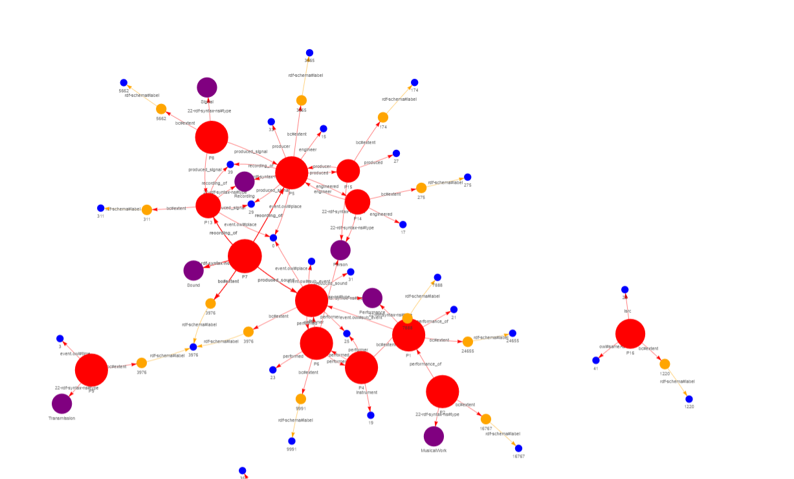

# 🐼 PaNDa+ RDF Pattern Mining Dashboard

A Streamlit-based implementation of the **PaNDa+ algorithm** for approximate mining patterns from RDF data, including visualization and export tools.

---

## 📄 Related Publication

This project is based on our published research:

👉 https://hal.science/hal-01418255/document

---

## 📌 Overview

This project implements a **research-oriented version of PaNDa+**, adapted for RDF graphs.

It allows you to:

* Load RDF data
* Convert it into a binary matrix
* Extract patterns using **PaNDa+ (A unifying framework for mining approximate top-k binary patterns)**
* Visualize patterns as a graph
* Export results (patterns, subjects, properties)

---

## 🖼️ Pipeline

<p align="center">
  
</p>

---

## 🚀 How to Run

### 1. Clone the repository

```bash
git clone https://github.com/Mussab85/panda_rdf_project.git
cd panda_rdf_project
```

---

### 2. Install dependencies

```bash
pip install -r requirements.txt
```

---

### 3. Run the application

```bash
streamlit run app.py
```

---

### 4. Use the app

* Upload an RDF file (`.rdf`)
* Adjust parameters in the sidebar
* Click **Run PANDA+**

You will see:

* Extracted patterns
* Graph visualization
* Debug logs

---

## ⚙️ Parameters

All parameters are controlled from the **Streamlit sidebar**.

---

### 🔹 `k` — Top-K Patterns

* **Description**: Maximum number of patterns to extract
* **Type**: Integer
* **Default**: `20`
* **Range**: `1 – 100`

---

### 🔹 `epsilon_r` — Row Noise Threshold (εr)

* **Description**: Controls tolerance for missing values in rows (subjects)
* **Effect**:

  * Lower → stricter patterns
  * Higher → more flexible patterns
* **Type**: Float
* **Default**: `0.5`
* **Range**: `0.0 – 1.0`

---

### 🔹 `epsilon_c` — Column Noise Threshold (εc)

* **Description**: Controls tolerance for missing values in columns (properties)
* **Effect**:

  * Lower → stricter item consistency
  * Higher → allows more variation
* **Type**: Float
* **Default**: `0.5`
* **Range**: `0.0 – 1.0`

---

### 🔹 `lambda` — Complexity Penalty

* **Description**: Controls trade-off between pattern size and noise
* **Type**: Float
* **Default**: `1.0`

---

## 🧠 Algorithm Notes

This implementation follows the **original PaNDa+ paper logic**:

* Uses **XOR-based cost function**
* Works on a **residual matrix (DR)**
* Extracts patterns iteratively:

  * Find core
  * Extend pattern
  * Update residual

### Important behaviors:

* ✔ Patterns may **share subjects (rows)**
* ✔ Each **cell (i, j)** is covered only once
* ✔ Small patterns are filtered for usability

---

## 📈 Visualization

The graph shows:

* Pattern nodes
* Property nodes
* Connections between them

Patterns are sized based on their **extent (number of subjects)**.

---

## 🌐 Graph Example

<p align="center">
  
</p>

---

## 📊 Output Files

After running, the system generates:

* `patterns.txt` → pattern definitions
* `subjects.txt` → subject index mapping
* `properties.txt` → predicate index mapping
* `graph.html` → interactive visualization

---

## 🧪 Example Workflow

1. Upload RDF dataset
2. Run with default parameters
3. Inspect patterns
4. Adjust εr / εc for stricter or looser patterns
5. Export results

---

## ⚠️ Notes

* Very small patterns are automatically filtered:

  * Minimum rows
  * Minimum items
  * Minimum area
* Large datasets may take time to process
* Results depend heavily on parameter tuning

---

## 📚 References

### 🔹 RDF Graph Summarization

* **Mussab Zneika**, Claudio Lucchese, Dan Vodislav, Dimitris Kotzinos
  *RDF Graph Summarization Based on Approximate Patterns*
  In: **International Workshop on Information Search, Integration, and Personalization (ISIP 2015)**
  Springer, Cham, 2015, pp. 69–87
  📅 Publication date: October 1, 2015
  📊 Citations: 29+
  🔗 https://hal.science/hal-01418255/document

  **Description:**
  This work proposes summarizing RDF graphs using **top-K approximate patterns**, generating a schema that reflects the *actually used structure* of the data.

---

### 🔹 PaNDa+ Algorithm

Claudio Lucchese, Salvatore Orlando, and Raffaele Perego. A unifying framework for mining approximate top-k binary patterns. IEEE Transactions On Knowledge and Data Engineering, 26(12):2900–2913, 2014. 

---

## 📖 Citation

If you use this project in your research, please cite:

```bibtex
@inproceedings{zneika2015rdf,
  author    = {Zneika, Mussab and Lucchese, Claudio and Vodislav, Dan and Kotzinos, Dimitris},
  title     = {RDF Graph Summarization Based on Approximate Patterns},
  booktitle = {International Workshop on Information Search, Integration, and Personalization},
  pages     = {69--87},
  year      = {2015},
  publisher = {Springer, Cham},
  url       = {https://hal.science/hal-01418255/document}
}
```

---

## 👨‍💻 Author

**Mussab Zneika**

---

## ⭐ License

This project is for academic and research purposes.
